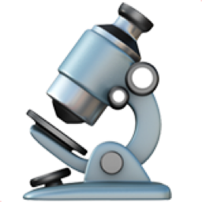

<table class="display table" id="table">
    <thead>
<!-- TODO: should be read from data file -->
        <tr>
            <th>OME-NGFF version</th>
            <th>URL</th>
            <th>SizeX</th>
            <th>SizeY</th>
            <th>SizeZ</th>
            <th>SizeC</th>
            <th>SizeT</th>
            <th>Axes</th>
            <th>Wells</th>
            <th>Fields</th>
            <th>Keywords</th>
            <th>License</th>
            <th>DOI</th>
            <th>Date added</th>
        </tr>
    </thead>
    <tbody>


{{ rec.["URL"] | split: "/" | last }}
{{ image_name | split: "." | first}}
        <tr>
            <td>{{ rec["OME-NGFF version"] }}</td>
            <td>
                <a href="{{ rec["URL"] }}">
                    {{ image_name }}
                </a> 
                <button class="no_border" title="Copy S3 URL to clipboard" onclick="copyTextToClipboard('{{ rec["URL"] }}')">
                    
                </button>
                
                
            </td>
            <td>{{ rec.["SizeX"] }}</td>
            <td>{{ rec.["SizeY"] }}</td>
            <td>{{ rec.["SizeZ"] }}</td>
            <td>{{ rec.["SizeC"] }}</td>
            <td>{{ rec.["SizeT"] }}</td>
            <td>{{ rec.["Axes"] }}</td>
            <td>{{ rec.["Wells"] }}</td>
            <td>{{ rec.["Fields"] }}</td>
            <td>{{ rec.["Keywords"] }}</td>
            <td>{{ rec.["License"] }}</td>

    </tbody>
</table>

